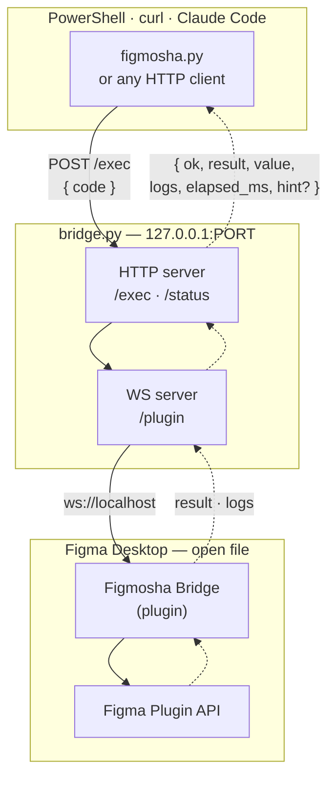

# Figmosha 2.3

Drive Figma from your terminal / Claude Code / any HTTP client. A tiny custom plugin sits inside Figma Desktop and holds a WebSocket to a local Python server — you send Figma Plugin API code over HTTP and get the result back.

No clipboard hacks. No screenshots.

Built on top of [**figmosha2**](https://github.com/denysosadchyi/figmosha2) by Denys Osadchyi — this repo is its 2.2+ rebuild: one copy of Figmosha per project, and any number of open Figma files inside it.

Fast enough to feel synchronous: reads ~5 ms, mutations ~30 ms, library component import ~150 ms.


## Why this exists

The Figma Plugin API is the most stable and powerful interface Figma offers. Thousands of plugins depend on it. But typically it's only accessible *inside* Figma's UI — you click "Run plugin", code executes, results appear in a panel.

Figmosha 2.0 keeps a plugin permanently open in Figma and exposes its Plugin API through a local network socket. You write code in your editor / Claude / a script, it runs inside Figma, and the result comes back to you.



Solid arrows carry the request, dotted ones the response.

## Highlights

- **One Python file** server + **one Python file** CLI, ~500 lines total. No npm. No frameworks.
- **Custom Figma plugin**, ~250 lines (JS + HTML). Imported in dev mode — no publishing.
- **22 helpers** baked into the plugin runtime as `h.*` so scripts stay short and safe (`h.bF`, `h.setText`, `h.withFonts`, `h.frame`, `h.hex`, `h.sel`, …).
- **11 high-level CLI subcommands** for common ops (`doctor`, `sel`, `tree`, `find`, `text`, `variant`, `clone`, `rm`, `icomp`, …).
- **`figmosha doctor`** walks the whole chain — bridge, plugin, round trip, which file is open — and names the fix at whichever link is broken.
- **Smart error hints** in responses — when a script fails with a known-pattern error, the response includes a `hint` field telling you how to fix it.
- **One copy per project, many files per copy.** `figmosha init` gives a copy its own port and its own entry in Figma's plugin menu; inside it, every open Figma file is a session you can address by name (`--session ds`).
- **Works while Figma is minimized.** WebSocket stays alive; JavaScript keeps executing in the background.
- **Auto-reconnect** in the plugin UI — restart the server and the plugin is back within 2 s.
- **Tested without Figma** — fake plugins drive the real WebSocket, so the bridge's guard, timeouts, session routing and handover are covered by `pytest`.

## What you can do with it

Anything the Figma Plugin API can do — which is most of what you can do by hand,
minus the clicking. In practice it comes down to the jobs that are miserable
manually because they repeat:

**Read the file.** Walk the node tree, find layers by name, type or their text,
dump a subtree with sizes and auto-layout settings, list local variables and
component sets, read what the user has selected right now.

**Edit content.** Set text on TEXT nodes with fonts loaded automatically —
including bulk passes over a whole subtree, where collecting every unique font
first is otherwise your problem. Rename layers, move and resize, clone next to
the original.

**Build structure.** Create frames, components and component sets, apply
auto-layout, nest and reorder. `h.frame` applies the properties in the order
Figma actually requires, which is not the order you'd guess.

**Work with the design system.** Bind fills, strokes, radii, padding, spacing
and sizes to variables. Import components and variables from a team library by
key. Switch instance variants, and ask what variants are even available.

**Get pixels out.** `node.exportAsync` returns PNG/SVG/PDF bytes; encode them
with `figma.base64Encode` and decode on the client side.

A worked example — build a three-variant button, then bind every colour and
every measurement to design tokens by name:

```bash
python figmosha.py exec --file build-button.js   # structure, hardcoded colours
python figmosha.py exec --file bind-tokens.js    # walk by name, bind variables
python figmosha.py "return h.dumpTree(await h.resolve('sel'), {showLayout:true})"
```

Splitting build from bind is the recommended shape for anything non-trivial:
each half is verifiable on its own, and a failure in the second doesn't leave
you guessing which half broke.

### What it can't do

- **Anything outside the open file.** The plugin is bound to whichever Figma
  file was open when you ran it. No cross-file operations, no file browser.
- **The parts Figma keeps to itself** — publishing to Community, plugin icons,
  account settings, comments (use the REST API for those).
- **Run without Figma Desktop open.** This is a bridge, not a headless renderer.
- **Survive a plugin restart mid-script.** Long operations are not resumable.

## HTTP API

The CLI is a convenience; the wire protocol is three endpoints and no
authentication beyond being on the machine.

| Endpoint | Body | Returns |
|---|---|---|
| `POST /exec` | `{code, timeout?, session?, want_value?}` | `{ok, result, value, logs, elapsed_ms, waited_ms}` |
| `GET /status` | — | `{plugin_connected, pending, project, sessions}` |
| `GET /sessions` | `?session=X` (optional) | `[{sid, file, page, alias, pending, queued, age_s}]`, plus `matched` when asked |
| `GET /` | — | service banner, including which project holds this port |
| `WS /plugin` | — | where the Figma plugin connects |

```bash
curl -s -X POST http://localhost:$PORT/exec \
  -H 'Content-Type: application/json' \
  -d '{"code":"return figma.currentPage.name"}'
```

- `result` is your return value stringified — compact JSON, sizes rounded to two
  decimals, capped at 64 KB with a visible `… truncated: N more characters`
  marker. It is what a human or an agent reads, and it is priced per character.
- `value` is the same thing raw, when it survives JSON — full precision, no
  truncation. Sending `{"want_value": false}` skips it: the plugin then
  serialises the result once instead of twice, which on a large tree is a whole
  extra walk. The CLI does that by default and asks for `value` only with `--raw`.
- `logs` collects everything `print(...)` emitted during the run, up to 200 lines;
  the rest is counted and reported instead of being sent.
- `timeout` is clamped to 1..600 seconds, because the deadline holds the
  document's lock — anything non-numeric is a `400`.
- Failures come back `500` with `{ok: false, error, hint?, stack, logs}`.
- No plugin connected is `503`; a script that outlives its `timeout` is `504`,
  with `waited_ms` and `ran_ms` splitting the time between queue and run.
- Several files connected and no `session` given is `409`, and the body lists the
  candidates. The target may be a session id, an alias, a file name or a name
  prefix; the bridge never picks for you.
- Bodies and WebSocket frames are capped at 16 MB, which is the practical limit
  on how large an export you can pull through in one call.

## Security

The bridge executes arbitrary JavaScript inside whichever Figma file you have
open. That makes every web page in your browser part of the threat model —
binding to `127.0.0.1` keeps other machines out, not other tabs.

Two checks handle it:

- **Origin** — local clients (curl, the CLI) never send this header and browsers
  always do on cross-origin requests, so its presence alone means the request
  came from a page, and it's refused. This closes the "simple request" trick of
  posting JSON as `text/plain` to dodge a CORS preflight. The plugin's sandboxed
  iframe reports `null` and is allowed through on the WebSocket only.
- **Host** — pinned to the loopback names actually served, which closes DNS
  rebinding, where a page re-points its own hostname at `127.0.0.1` to become
  same-origin with the bridge and read the responses.

`--host 0.0.0.0` disables the Host check, because the reachable names are then
unknowable. The bridge says so loudly at startup. Don't do it on a network you
share.

## Requirements

- **Figma Desktop** (Stable or Beta) — [download](https://www.figma.com/downloads/). The browser version cannot import local development plugins.
- **Python 3.10+** — for the bridge server and CLI client. Stdlib + a single dependency (`aiohttp`).
- **OS**: macOS, Windows (native or WSL2), or Linux.

## Install

Hand this repo to Claude Code and let it do the setup:

```
https://github.com/denysosadchyi/figmosha2 — set this up for me
```

It clones the repo, creates the venv, installs `aiohttp`, starts the bridge, and tells you what to click in Figma. `CLAUDE.md` in the repo root is written for exactly this — Claude reads it and knows the whole workflow, and `.claude/skills/` adds the task-shaped ones (building a component, reviewing against the design system, dev handoff, layer naming).

Two things Claude cannot do for you, because Figma exposes no API for either:

1. **Import the plugin** — in Figma Desktop: **Plugins → Development → Import plugin from manifest…**, pick `plugin/manifest.json` from this folder. Once per project.
2. **Run the plugin** — **Plugins → Development → Figmosha · <project>**. A small green bar with the file's name appears; the bridge logs `[plugin] <sid>: connected`. You're live. Open a second file and run it there too — that is a second session, not a conflict.

Ask Claude for the smoke test and it will confirm the round trip works end to end.

<details>
<summary>Prefer to do it by hand?</summary>

```bash
git clone https://github.com/denysosadchyi/figmosha2.git
cd figmosha2

python3 -m venv venv && ./venv/bin/pip install aiohttp   # macOS / Linux / WSL
python  -m venv venv && .\venv\Scripts\pip install aiohttp   # Windows

./venv/bin/python figmosha.py init --name MyProject   # port + plugin identity

bash start-bridge.sh        # detached tmux session "figmosha-bridge"
./venv/bin/python bridge.py # …or just keep a terminal open
```

`init` picks the port and writes it to `project.json`; the bridge, the CLI and
the launchers all read it from there. Import and run the plugin as described
above, then check it:

```bash
./venv/bin/python figmosha.py status
# → «MyProject» localhost:8834 · 1 file(s) connected · 0 pending

./venv/bin/python figmosha.py "return figma.currentPage.name"
# → "Page 1"
```

**WSL2**: `localhost` ports forward to the Windows host automatically, so a bridge inside WSL is reachable from Figma on Windows. Figma, though, can only import a plugin from a Windows path — so put the copy itself on the Windows side (`/mnt/c/...`) and import `plugin/manifest.json` straight from there. Don't keep a second copy just for Figma: `figmosha init` stamps this project's port and plugin id into `plugin/manifest.json` and `plugin/ui.html`, and the copy Figma imported would go on running the stale pair.

</details>

## Daily use

### Start a session

```bash
bash start-bridge.sh     # macOS / Linux / WSL — detached tmux session
.\start-bridge.ps1       # native Windows — detached, -Restart / -Stop too
# In Figma: Plugins → Development → Figmosha Bridge → Run
```

The bridge survives SSH disconnects and terminal closes (tmux). It does **not** survive OS reboot or WSL shutdown — restart it after either.

### A shorter way to type it

`figmosha.cmd` (Windows) and `figmosha` (macOS / Linux) sit next to `figmosha.py`
and run it with this copy's venv:

```powershell
.\figmosha props sel          # instead of  python figmosha.py props sel
```

They resolve the copy from their own location, not the working directory, so
`E:\projects\acme\figmosha props sel` works from anywhere and still talks to
that project's bridge. Putting one copy's folder on PATH turns it into a bare
`figmosha` — worth doing for the project you live in, but only one copy can own
the name.

### Send code

```bash
# Inline JS
python figmosha.py "return figma.currentPage.children.length"

# From a file
python figmosha.py exec --file my-script.js

# From stdin
cat my-script.js | python figmosha.py exec --stdin

# Plain HTTP (no Python needed)
curl -s http://localhost:$PORT/exec \
  -H 'Content-Type: application/json' \
  -d '{"code":"return 1+1"}'
```

### High-level CLI commands

When the operation fits one of these, use the dedicated subcommand — much less typing and less risk of escape bugs:

```bash
python figmosha.py doctor                        # diagnose the chain, with fixes
python figmosha.py sel                           # what's selected in Figma right now
python figmosha.py props 1:23                    # everything set on one node, tokens by name
python figmosha.py props sel --all               # ... including defaults (opacity 1, MIN/MIN)
python figmosha.py props 1:23 --children         # ... plus each child's FILL/HUG/FIXED sizing
python figmosha.py vars                          # map of variable collections and their modes
python figmosha.py vars color/bg                 # matching variables, one column per mode
python figmosha.py vars --library brand          # library variables + keys for h.importVar()
python figmosha.py styles                        # local paint / text / effect / grid styles
python figmosha.py tree 1:23 --depth 2           # dump subtree
python figmosha.py tree sel --layout             # subtree of the selection, with layout
python figmosha.py find 1:23 name=Button         # find by exact name
python figmosha.py find 1:23 name~Btn            # substring name match
python figmosha.py find 1:23 type=INSTANCE       # filter by type
python figmosha.py find 1:23 text~hello          # find TEXT containing "hello"
python figmosha.py text 1:25 "new content"       # set TEXT chars (autoloads fonts)
python figmosha.py variant 1:30 "Property 1=Default"
python figmosha.py clone 1:23 --right --gap 100  # clone adjacent
python figmosha.py rm 1:99 1:100 1:101           # delete one or more nodes
python figmosha.py rm sel                        # delete everything selected
python figmosha.py find 1:23 type=TEXT --raw     # same query, full JSON instead of rows
python figmosha.py icomp <component-key>         # import library component, place + zoom
python figmosha.py status                        # bridge + plugin connection state
python figmosha.py update                        # pull + re-stamp this copy's plugin identity
```

## Code conventions

The plugin wraps your code as:

```js
new Function("figma", "print", "h", `return (async () => { <YOUR CODE> })();`)(figma, print, HELPERS)
```

- `await` works everywhere. Body is wrapped in an async IIFE.
- Whatever you `return` becomes the HTTP response's `result` (string) and `value` (raw JSON-serializable form).
- `print(...)` collects lines into the `logs` array — also streamed to the plugin UI for live debugging.

### Helpers (available as `h.*` in every exec)

| Helper | Use |
|---|---|
| `await h.bF(node, idx, var)` | Bind fill paint at `idx` to a variable (handles frozen-array dance) |
| `await h.bS(node, idx, var)` | Bind stroke paint to a variable |
| `await h.bN(node, prop, var)` | Bind numeric prop (radius, padding, size, itemSpacing, …) |
| `await h.applyStyle(node, kind, name)` | Apply a style — `fill`, `stroke`, `text`, `effect`, `grid` |

See also the `set` and `bind` commands, which cover the same ground without a script.
| `h.findByName(root, name)` | First descendant with exact name |
| `h.findAllByName(root, name)` | All descendants with exact name |
| `h.dumpTree(node, {maxDepth, showSize, showText, showLayout})` | Indented tree string |
| `await h.withFonts(root, asyncFn)` | Auto-loads every unique font in the subtree, then runs your callback |
| `await h.setText(node, text)` | Sets `node.characters` with auto font load (single-font nodes only) |
| `h.cloneNext(node, {direction, gap, name})` | Clone + place adjacent (`right`/`left`/`up`/`down`) |
| `await h.variant(instance, props)` | Wrapper around `instance.setProperties(...)` |
| `await h.variantsOf(instance)` | `{current, groups, all}` of the component set |
| `h.sel()` | Currently selected nodes as `{id,name,type,w,h}` |
| `h.resolve(idOrAlias)` | Node by id, or the aliases `page` / `sel` |
| `h.hex("#1a2b3c")` | Hex to Figma's 0..1 `{r,g,b}` |
| `h.solid("#1a2b3c", opacity?)` | Ready-to-assign paint array |
| `h.frame(parent, opts)` | Frame with auto-layout applied in the right order |
| `await h.node(id)` | Shorthand for `figma.getNodeByIdAsync(id)` |
| `await h.var_(name)` | Resolve a variable by name, local id, or library key (`null` if there is none) |
| `await h.style_(kind, name)` | Resolve a style the same way |
| `await h.importComp(key)` | `figma.importComponentByKeyAsync(key)` |
| `await h.importVar(key)` | `figma.variables.importVariableByKeyAsync(key)` |

Compared to inlined boilerplate, helpers reduce a typical script by ~60–70% and avoid common gotchas (frozen `node.fills`, missing `loadFontAsync`, deprecated sync `getVariableById`).

#### Addressing a variable or style by name

Everywhere a helper takes `var` or `name`, it accepts what `figmosha vars` and `figmosha styles` print — the name — as well as a local id (`VariableID:…`, `S:…`) or a library key. Names are matched most specific first: exact, then ignoring case, then qualified with the collection (`Semantics/color/bg/default`), then as a suffix on a `/` boundary (`bg/default` finds `color/bg/default`, and never `bg/default-alt`).

A name that matches more than one variable **throws with the candidates listed** rather than picking one. That case is not rare: a themed library has every primitive twice, once per theme collection. `figmosha vars` prints exactly those names qualified, so the form it shows is the form that resolves.

### Error hints

When a script fails with a recognized pattern, the response includes a `hint` field. The CLI prints it for you:

```
$ figmosha.py "node.characters = 'x'"
figmosha: Cannot write to node with unloaded font "Inter Regular"...
   hint: use h.setText(node, text) or h.withFonts(root, fn) — they autoload fonts
```

Currently hints cover: fills/strokes variable binding, frozen arrays, missing manifest permissions, unloaded fonts, appendChild order, invalid variant values, and a few more.

## Limits / gotchas

- Plugin is bound to the **currently open Figma file**. Switching files closes the plugin — re-Run it in the new file, where it becomes another session.
- **One session per document, not per page.** `figma.currentPage` is document-wide, so two agents cannot split one file by page — they would switch pages under each other. Address nodes by id (`getNodeByIdAsync` after `loadAllPagesAsync`) instead.
- **Scripts in one file are serialised.** A long one makes the next wait rather than interleave mid-`await`. Different files run in parallel.
- The **same document open twice** (two Figma windows) is still one session: the second plugin is turned away. If the first has gone silent (laptop slept) the newcomer takes over within about a second, so a genuine reconnect is never locked out.
- Ports are per project. A copy without `project.json` will not start a bridge — run `figmosha init` first.
- **Figma sync errors** ("Unable to establish connection to Figma after 10 seconds") sometimes appear when fetching nodes from non-current pages. If you need cross-page access: `await figma.loadAllPagesAsync()` first.
- Bridge binds to `127.0.0.1` by default. For LAN access: `python bridge.py --host 0.0.0.0` (not recommended — anyone on your LAN can then run arbitrary code in your Figma).
- Manifest changes (new permissions, etc.) require **re-importing** the plugin in Figma. `code.js` and `ui.html` changes are picked up on next Run.

## Troubleshooting

Before reading this table, try `python figmosha.py doctor` — it walks the same
chain and tells you which link is broken.

| Symptom | Cause | Fix |
|---|---|---|
| `connection refused` from CLI | Server not running | `bash start-bridge.sh`, or `.\start-bridge.ps1` on Windows |
| `plugin not connected` (503) | Plugin window closed | Plugins → Development → Figmosha Bridge → Run |
| Plugin says `disconnected, retrying…` | Server is down or restarting | Start it; plugin auto-reconnects within 2 s |
| 504 timeout | Code threw silently or `await` never resolved | Close the plugin (X), Run again. Increase `--timeout` for legitimately long ops |
| `permission not specified in manifest` | API needs a permission not declared in `manifest.json` | Add to `permissions` array, sync to Windows path if applicable, **re-import** plugin |
| `Cannot write to node with unloaded font` | Need to load fonts first | Use `await h.setText(...)` or wrap edits in `h.withFonts(root, fn)` |
| `Cannot assign to read only property` | `node.fills` is frozen | Use `await h.bF(node, idx, varId)` or copy: `JSON.parse(JSON.stringify(node.fills))` |
| `pip install aiohttp` fails on Linux | Python externally-managed environment (PEP 668) | Use the venv approach (always preferred) or `pip install --user --break-system-packages aiohttp` |
| Tmux not installed (Windows native) | `start-bridge.sh` needs bash + tmux | Use `.\start-bridge.ps1` — same thing, detached, with `-Restart` and `-Stop` |
| `403 cross-origin requests are not allowed` | Something is adding an `Origin` header | Talk to the bridge directly, not through a proxy or a browser |
| Plugin shows `Slot busy` | The plugin is already running in another Figma window | Close it there; this one retries every 15 s |
| Helper missing: `h.X is not a function` | The running plugin still has the code it started with | Re-run the plugin in Figma after syncing `plugin/` |

## Project layout

```
bridge.py              HTTP/WS server: origin guard, session registry, error hints
figmosha.py            CLI client and subcommands
project.py             reads project.json — this copy's name and port
project.json           generated by `figmosha init`; gitignored per copy
start-bridge.sh        tmux-based bridge management (macOS / Linux / WSL)
start-bridge.ps1       detached launcher for native Windows (-Restart / -Stop)
plugin/
  manifest.json        Permissions + allowed origins
  code.js              Plugin sandbox: exec + the h.* helpers
  ui.html              WS client, auto-reconnect, status bar
  icon.png             128×128, for publishing to Community
tests/
  test_bridge.py       Bridge driven by a fake plugin over a real WebSocket
  helpers.test.js      Pure helpers against a stubbed Figma
CLAUDE.md              Conventions for Claude Code sessions driving Figmosha
CLAUDE.local.md        Your machine's paths and hosts — gitignored, never committed
.claude/skills/        Task skills: component-builder, ds-review, handoff-spec, naming-audit
docs/                  setup-new-project.md ships; journals and audits stay local
README.md              This file
```

## Contributing / extending

The plugin runtime is just `new Function("figma", "print", "h", body)`. Add helpers to `HELPERS` in `plugin/code.js`, sync the file to your plugin path, and they're available in your next `exec`.

To add a new CLI subcommand:
1. Add a `cmd_<name>(args)` function in `figmosha.py` that builds JS via `json.dumps`-escaped templates
2. Add a subparser in `build_parser()`
3. Register in the `dispatch` map

To add an error hint:
1. Append a `(needle, hint)` tuple to `ERROR_HINTS` in `bridge.py`
2. Restart the bridge

## Tests

No Figma needed — a fake plugin drives the bridge over a real WebSocket:

```bash
pip install pytest aiohttp
pytest -q            # bridge: guard, round trip, timeouts, sessions; CLI: argv, generated JS
node tests/helpers.test.js   # pure helpers: hex maths, auto-layout ordering, result shaping
```

## Changelog

See [CHANGELOG.md](CHANGELOG.md). After upgrading, re-run the plugin in Figma so
it picks up the new `plugin/code.js`; if `plugin/manifest.json` changed, re-import
it instead. `python figmosha.py update` does the pull and the re-stamping in one
step.

## Credits

Figmosha is built on top of [figmosha2](https://github.com/denysosadchyi/figmosha2)
by [Denys Osadchyi](https://github.com/denysosadchyi) — the original bridge, plugin
runtime and `h.*` helper surface come from there.

What this repo adds on top: two axes of multiplexing. A copy claims a **project**
(its own port and plugin identity, see `project.json` / `figmosha init`), and
inside one copy the bridge serves **any number of open Figma files** at once,
one session each, with per-session routing and locks.

## License

MIT
